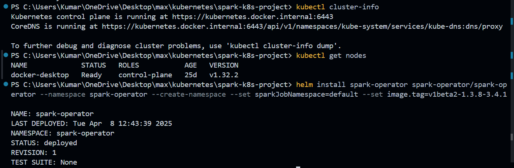
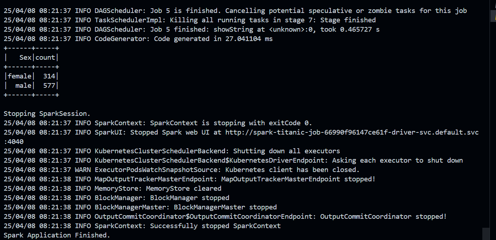
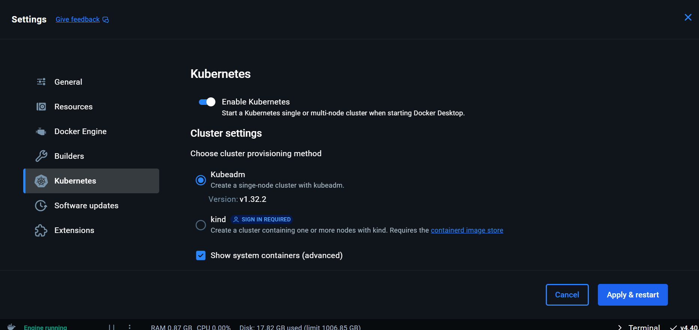

**Project Goal:** To build and run a distributed PySpark data processing job on a local Kubernetes cluster (Docker Desktop) using the Spark on Kubernetes Operator.

**Final Technology Stack:**

- **OS:** Windows (using PowerShell)
- **Editor:** VSCode
- **Python:** 3.9.x / 3.10.x
- **Virtual Environment Tool:** `venv`
- **Containerization:** Docker Desktop for Windows (Latest Stable, with Kubernetes Enabled)
- **Kubernetes CLI:** `kubectl` (Bundled with Docker Desktop)
- **Package Manager:** Helm v3.12.x+
- **PySpark:** 3.4.1
- **Spark Base Docker Image:** `apache/spark-py:v3.4.1`
- **Spark Operator:** Helm Chart `spark-operator/spark-operator` (from `https://kubeflow.github.io/spark-operator`) - Default chart version used.

**Final Project Structure:**

```
spark-k8s-project/
├── data/
│   └── train.csv       # Titanic dataset CSV file
├── venv/                 # Python virtual environment
├── Dockerfile            # Defines the Spark application image
├── process_data.py       # The PySpark script
├── spark-rbac.yaml       # Kubernetes RBAC definitions for Spark
└── spark_job.yaml        # Kubernetes manifest for the SparkApplication
```

---

**Phase 1: Environment Setup**

1. **Create Project Directory:**
    - *Command (Run in PowerShell, navigate to your desired parent folder):*
        
        ```powershell
        mkdir spark-k8s-project
        cd spark-k8s-project
        ```
        
2. **Create and Activate Virtual Environment:**
    - *Command (Run in `spark-k8s-project` directory):(Prompt changes to show `(venv)`)*
        
        ```powershell
        python -m venv venv
        .\\venv\\Scripts\\Activate.ps1
        ```
        
3. **Install PySpark:**
    - *Command (Run in `spark-k8s-project` directory, venv active):*
        
        ```powershell
        pip install pyspark==3.4.1
        ```
        
4. **Confirm Kubernetes Context:**
    - *Command (Run anywhere in PowerShell):(Should show `docker-desktop`. If not: `kubectl config use-context docker-desktop`)*
        
        ```powershell
        kubectl config current-context
        ```
        

---

**Phase 2: Spark Application, Data, and Containerization**

1. **Get Sample Data:**
    - Download `train.csv` from Kaggle Titanic competition: [https://www.kaggle.com/competitions/titanic/data](https://www.kaggle.com/competitions/titanic/data)
    - Create the `data` subdirectory:
        - *Command (Run in `spark-k8s-project` directory):*
            
            ```powershell
            mkdir data
            ```
            
    - Place the downloaded `train.csv` into the `spark-k8s-project/data/` folder.
2. **Create Spark Script (`process_data.py`):**
    - *Location:* `spark-k8s-project/process_data.py`
    - *Complete Code:*
        
        ```python
        from pyspark.sql import SparkSession
        from pyspark.sql.functions import col, count
        
        # Application entry point
        if __name__ == "__main__":
            print("Starting Spark Application...")
        
            # Create SparkSession
            # When running on K8s, SparkConf is usually handled by the submission process
            spark = SparkSession.builder \\
                .appName("TitanicDataProcessing") \\
                .getOrCreate()
        
            print("SparkSession Created.")
        
            # Define the path INSIDE the container where data will be
            # This path is determined by how we build the Docker image later
            input_path = "/app/data/train.csv"
            print(f"Reading data from {input_path}")
        
            try:
                # Read data
                df = spark.read.csv(input_path, header=True, inferSchema=True)
                print("Data loaded successfully.")
                df.printSchema()
        
                # Perform calculation for total rows before printing
                total_rows = df.count()
                print(f"Total rows: {total_rows}") # Use the calculated value
        
                # Simple analysis: Count passengers by Sex
                print("Passenger Count by Sex:")
                passenger_counts = df.groupBy("Sex").agg(count("*").alias("count"))
                passenger_counts.show() # Show the result table
        
            except Exception as e:
                print(f"Error during Spark processing: {e}") # Print specific error
        
            finally:
                # Stop SparkSession
                print("Stopping SparkSession.")
                spark.stop()
                print("Spark Application Finished.")
        ```
        
3. **Create Dockerfile (`Dockerfile`):**
    - *Location:* `spark-k8s-project/Dockerfile`
    - *Complete Code:*
        
        ```
        # Use an official Spark Python base image matching our PySpark version
        FROM apache/spark-py:v3.4.1
        
        # Set the working directory inside the container
        WORKDIR /app
        
        # Copy the Python script into the container
        COPY process_data.py /app/
        
        # Copy the data directory into the container
        COPY data /app/data/
        
        # No ENTRYPOINT or CMD needed, Spark operator will specify the entry point
        ```
        
4. **Build Docker Image:**
    - Ensure Docker Desktop is running.
    - *Command (Run in `spark-k8s-project` directory):*
        
        ```powershell
        docker build -t spark-titanic-app:latest .
        ```
        

---

**Phase 3: Kubernetes Spark Operator Setup**

1. **Add Spark Operator Helm Repository:**
    - *Commands (Run anywhere in PowerShell):*
        
        ```powershell
        # Add the correct Kubeflow Spark Operator repository
        helm repo add spark-operator <https://kubeflow.github.io/spark-operator>
        
        # Update Helm repositories
        helm repo update
        ```
        
2. **Install Spark Operator using Helm:**
    - *Command (Run anywhere in PowerShell):*
        
        ```powershell
        # Install using default image tag from the chart
        helm install spark-operator spark-operator/spark-operator --namespace spark-operator --create-namespace --set sparkJobNamespace=default
        ```
        
3. **Verify Operator Pods:**
    - *Command (Run anywhere in PowerShell):(Wait until both `spark-operator-controller-...` and `spark-operator-webhook-...` pods are `Running` and `1/1 Ready`)*
        
        ```powershell
        kubectl get pods -n spark-operator
        ```
        

---

**Phase 4: Kubernetes RBAC Setup for Spark**

1. **Create RBAC Definition File (`spark-rbac.yaml`):**
    - *Location:* `spark-k8s-project/spark-rbac.yaml`
    - *Complete Code:*
        
        ```yaml
        # LOCATION: spark-k8s-project/spark-rbac.yaml
        # --- ENTIRE FILE CONTENT ---
        apiVersion: v1
        kind: ServiceAccount
        metadata:
          name: spark
          namespace: default
        ---
        apiVersion: rbac.authorization.k8s.io/v1
        kind: Role
        metadata:
          name: spark-role
          namespace: default
        rules:
          # Permissions needed by the driver pod to manage executor pods & cleanup
          - apiGroups: [""]
            resources: ["pods"]
            verbs: ["create", "get", "list", "watch", "delete", "deletecollection"]
          - apiGroups: [""]
            resources: ["services", "configmaps"]
            verbs: ["create", "get", "list", "delete", "deletecollection"]
          # Optional: Permissions for PersistentVolumeClaims if used (good to include)
          - apiGroups: [""]
            resources: ["persistentvolumeclaims"]
            verbs: ["create", "get", "list", "delete", "deletecollection"]
        ---
        apiVersion: rbac.authorization.k8s.io/v1
        kind: RoleBinding
        metadata:
          name: spark-role-binding
          namespace: default
        subjects:
          - kind: ServiceAccount
            name: spark # The ServiceAccount created above
            namespace: default
        roleRef:
          kind: Role # Granting the Role defined above
          name: spark-role
          apiGroup: rbac.authorization.k8s.io
        # --- END OF FILE CONTENT ---
        ```
        
2. **Apply RBAC Definitions:**
    - *Command (Run in `spark-k8s-project` directory):*
    
    
    

```powershell
kubectl apply -f spark-rbac.yaml -n default
```

---

**Phase 5: Spark Job Definition and Execution**

1. **Create Spark Application Manifest (`spark_job.yaml`):**
    - *Location:* `spark-k8s-project/spark_job.yaml`
    - *Complete Code:*
        
        ```yaml
        apiVersion: "sparkoperator.k8s.io/v1beta2"
        kind: SparkApplication
        metadata:
          name: spark-titanic-job # Name of your Spark job in K8s
          namespace: default     # Namespace where the job will run
        spec:
          type: Python
          pythonVersion: "3"
          mode: cluster
          image: "spark-titanic-app:latest" # Your custom image
          imagePullPolicy: IfNotPresent     # Use local image if available
          mainApplicationFile: "local:///app/process_data.py" # Path inside container
          sparkVersion: "3.4.1"          # Spark version matching image/pyspark
          restartPolicy:
            type: Never
          driver:
            cores: 1
            coreLimit: "1200m"
            memory: "512m"
            labels:
              version: 3.4.1
            serviceAccount: spark  # Use the created service account
          executor:
            cores: 1
            instances: 1
            memory: "512m"
            labels:
              version: 3.4.1
            serviceAccount: spark  # Use the created service account
        ```
        
2. **Submit the Spark Job:**
    - *Command (Run in `spark-k8s-project` directory):*
        
        ```powershell
        # Ensure any previous failed attempts are removed
        kubectl delete sparkapplication spark-titanic-job -n default --ignore-not-found=true
        
        # Apply the job definition
        kubectl apply -f spark_job.yaml
        ```
        
3. **Monitor Execution:**

- Watch overall status:
    - *Command (Run anywhere in PowerShell):(Wait for STATUS to become `COMPLETED`. Press Ctrl+C to exit watch)*
        
        ```powershell
        kubectl get sparkapplication spark-titanic-job -n default -w
        ```
        
- Check pods (optional, for detail):
    - *Command (Run anywhere in PowerShell):(Should see driver and executor pods reach `Completed` state)*
        
        ```powershell
        kubectl get pods -n default | findstr spark-titanic-job
        ```
        



1. **Verify Output:**
    - Find the completed driver pod name:
        - *Command (Run anywhere in PowerShell):(Note the full pod name, e.g., `spark-titanic-job-driver`)*
            
            ```powershell
            kubectl get pods -n default | findstr spark-titanic-job.*driver
            ```
            
    - Check the driver logs:
        - *Command (Run anywhere in PowerShell, replace `<driver-pod-name>`):*
            
            ```powershell
            kubectl logs <driver-pod-name> -n default
            ```
            
        - *(Look for the "Passenger Count by Sex:" table and "Spark Application Finished." message in the output.)*

---

This summary covers the complete, corrected process from initial setup to the final successful execution of the Spark job on Kubernetes.

turn on Kubernetes on Docker Desktop first.



# Define access key and secret key (choose your own secure values!)

$env:MINIO_ACCESS_KEY="sparkdev”

$env:MINIO_SECRET_KEY="localDevKey123!”

# Install MinIO

helm install minio minio/minio --namespace minio --create-namespace   `--set accessKey=$env:MINIO_ACCESS_KEY`
--set secretKey=$env:MINIO_SECRET_KEY `
--set defaultBuckets="sparkdata" # Pre-create a bucket named 'sparkdata'

helm install minio minio/minio --namespace minio --create-namespace   `--set accessKey=$env:MINIO_ACCESS_KEY`
--set secretKey=$env:MINIO_SECRET_KEY `
--set defaultBuckets="sparkdata"
